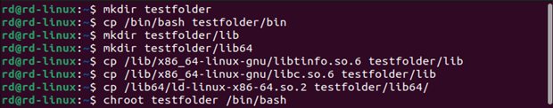
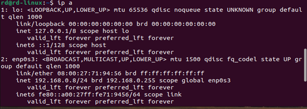
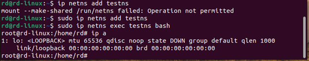
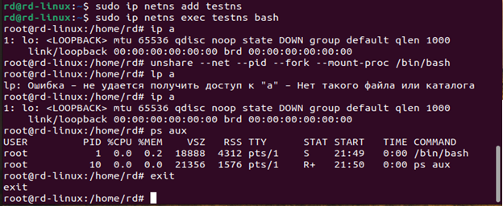

### Домашняя работа №1. Механизмы пространства имен

#### Необходимо продемонстрировать изоляцию одного и того же приложения (как решено на семинаре - командного интерпретатора) в различных пространствах имен

**Решение:**

1.	Изменяем корневую папку.

2.	Просматриваем информацию об интерфейсах сети на компьютере, включая их IP-адреса, состояние и другие параметры.

3.	Изолируемся в сетевом пространстве имен.

4.	Разграничивать сетевое пространство имен, процессы, память, дерево процессов.

