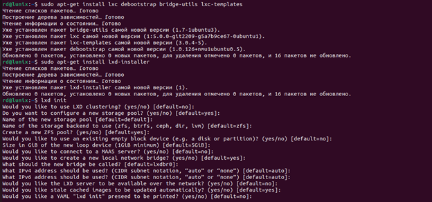
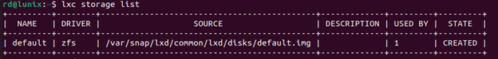
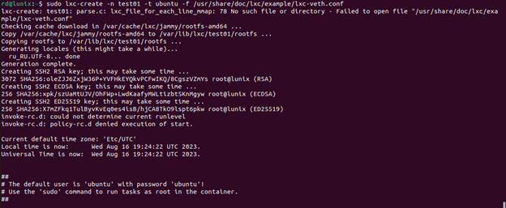
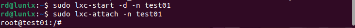
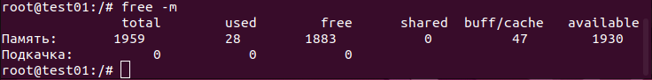
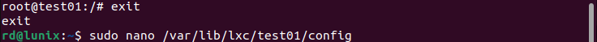
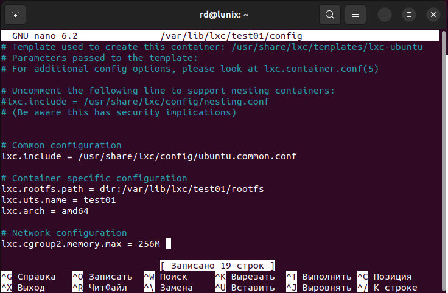
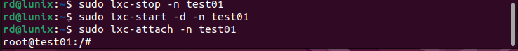

### Задание:
- запустить контейнер с Ubuntu, используя механизм LXC;
- ограничить контейнер 256 Мб ОЗУ и проверить, что ограничение работает.

**1. Запустить контейнер с Ubuntu, используя механизм LXC**

- Устанавливаем пакеты для создания контейнеров LXC, включая утилиты debootstrap и bridge-utils, а также шаблоны контейнеров. Устанавливаем инструмент LXD Installer для установки и настройки LXD на сервере. Запускаем процесс настройки LXD.

- Выводим список доступных хранилищ LXD на сервере.

- Создаем новый контейнер с именем "test01" на базе образа Ubuntu.

- Запускаем контейнер в режиме демона и подключаемся к нему.

**2. Ограничить контейнер 256 Мб ОЗУ и проверить, что ограничение работает**

- Выясняем текущий размер оперативной памяти, выделенной для данного контейнера системой.

- Ограничим размер выделенной контейнеру памяти ОЗУ. Выходим из контейнера и заходим в конфигурационный файл.

- Добавляем строку lxc.cgroup2.memory.max = 256M, где 256М - ограничение памяти в 256М.

- Перезагружаем контейнер.

- Выясняем текущий размер оперативной памяти, выделенной для данного контейнера системой. Видим, что размер оперативной памяти ограничен и равен 256М.
