### 1. Установка Docker

1. Обновляем списки пакетов
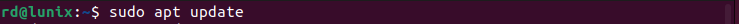

2. Устанавливаем пакеты, которые позволят использовать репозиторий по HTTPS
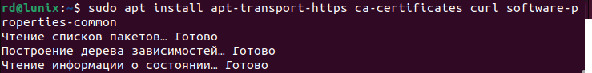

3. Добавляем официальный GPG-ключ Docker
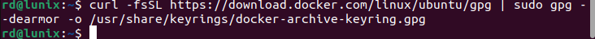

4. Добавляем репозиторий Docker к списку источников пакетов
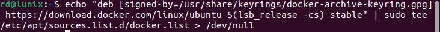

5. Обновляем список пакетов, чтобы включить информацию о пакетах Docker из добавленного репозитория

6. Устанавливаем Docker
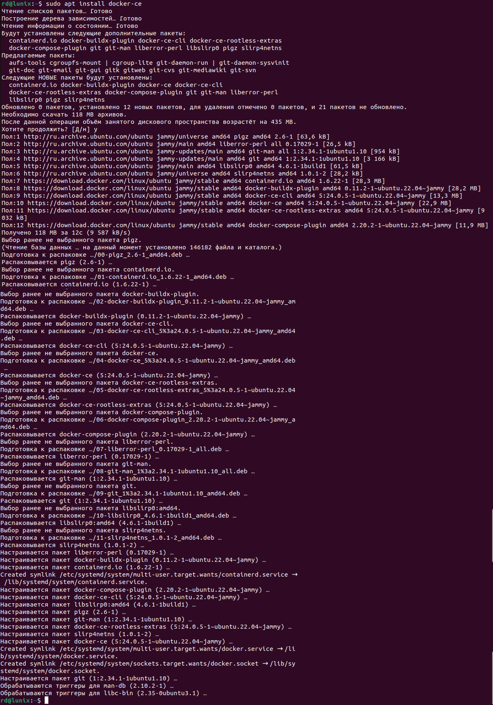

7. Добавляем своего пользователя в группу Docker, чтобы избежать использования sudo для запуска Docker-команд

8. Применяем изменения командой newgrp docker либо перезагружаем систему. Проверяем работу Docker
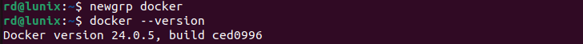

### 2. Тестирование Docker

Запукаем контейнер с использованием образа "cowsay".
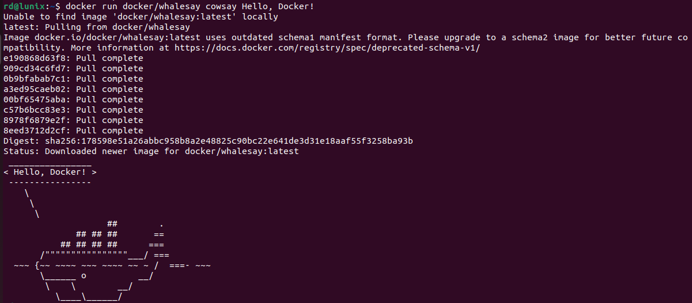

Можно заменить текст "Hello, Docker!" на любой другой текст. Например, **запуск контейнера с рисунком кота**.
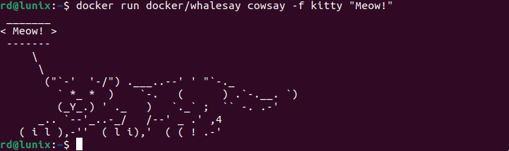

### 3. Тест команд Docker

1. Смотрим, какие образы у нас установлены
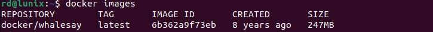

2. Смотрим список активных контейнеров (отсутствуют) и вообще всех имеющихся в системе
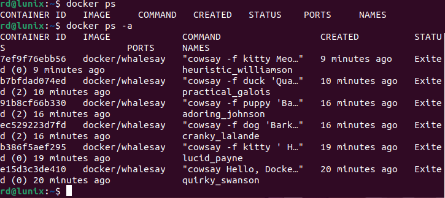

3. Удаляем один контейнер по его Id и вновь проверяем список контейнеров. 
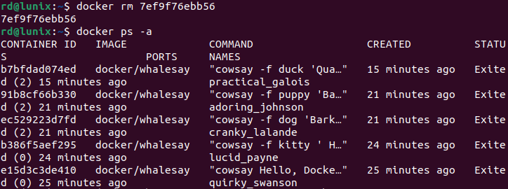

4. Аналогично удаляем все оставшиеся контейнеры. Убеждаемся, что список контейнеров теперь пуст.
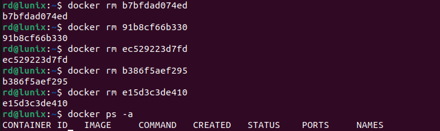

5. Удаляем образ
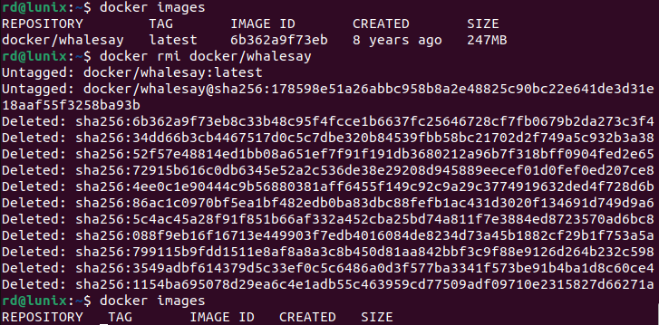

### 4. Хранение данных в контейнерах Docker

1. Запустим контейнер из образа Ubuntu и войдем в него
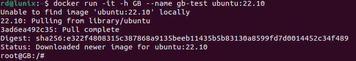

2. Посмотрим содержимое корневой директории
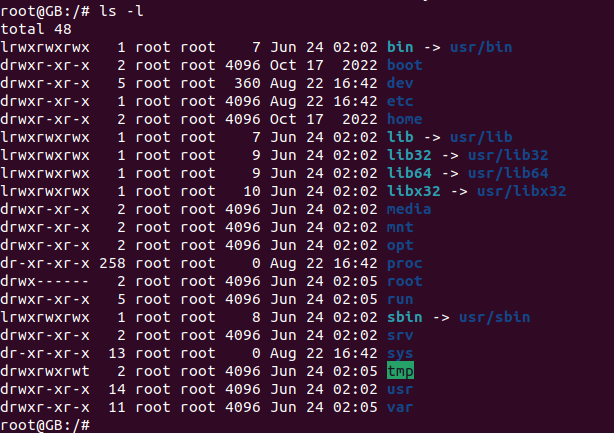

3. Создадим новую директорию в корне. 

4. Создадим файл "passwords.txt" и добавим в него какие-либо данные. В контейнере не установлен текстовый редактор, поэтому справимся без него. Просмотрим содержимое файла.
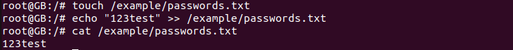

5. Выйдем из контейнера. Проверим, сохранятся ли введенные данные, если контейнер будет остановлен. Снова запустим контейнер: **данные сохранились, так как контейнер не пересоздавался**
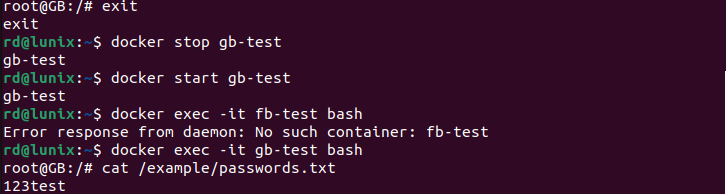

6. Удалим контейнер и создадим его заново, используя те же команды: **данные утеряны, так как контейнер был удален**
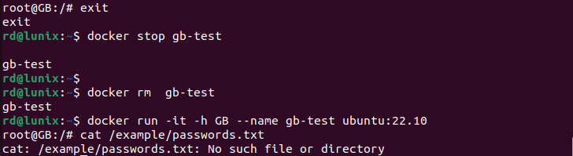

### 5. Работа с внешним хранилищем

Создадим директорию /test/folder на хосте и подмонтируем ее к папке контейнера /otherway. Теперь всё, что сохраняется в папку контейнера /otherway, будет появляться также и в хостовой (за пределами контейнера, у родителя) папке /test/folder. И если удалить контейнер, то данные в этой папке останутся.
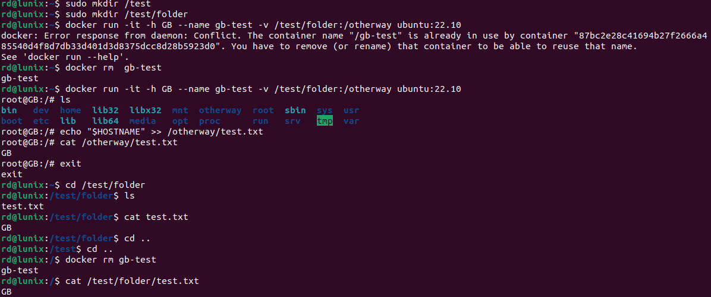
Это работает и в обратную сторону, даже если подключить контейнер к уже наполненной хостовой папке.
Важно избегать хранения важных данных внутри контейнеров, чтобы предотвратить потерю информации.

### 6. Практические примеры хранения данных в контейнерах Docker

1. Создадим папку для монтирования в контейнер на хосте и поместим в неё файл test.txt с каким-то содержимым
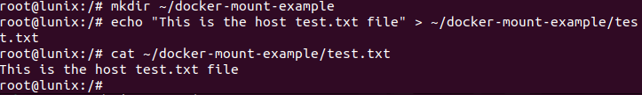

2. В домашней директории создаем файл test.txt, который также понадобится для монтирования в контейнер, но с другим содержимым
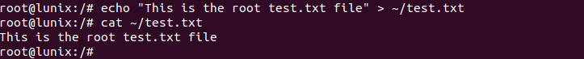

3. Создадим контейнер из образа ubuntu:22.10, в папку которого примонтируем хостовую папку и одновременно рутовый test.txt
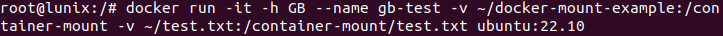

4. Посмотрим содержимое текстового файла в контейнере

При просмотре содержимого файла test.txt в контейнере мы видим содержимое рутового файла test.txt из домашней директории, а не файла test.txt из примонтированной папки.