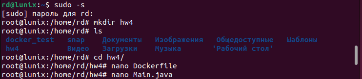
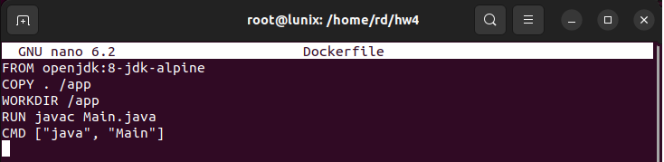
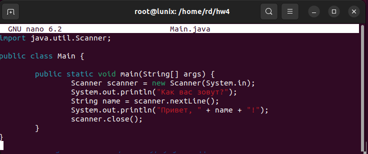
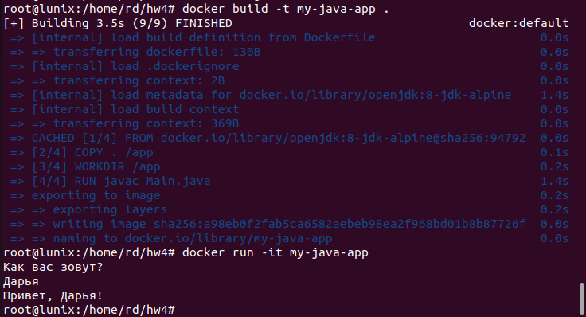

### Домашнее задание №4. Dockerfile и слои

#### Необходимо создать Dockerfile, основанный на любом образе (вы в праве выбрать самостоятельно). В него необходимо поместить приложение, написанное на любом известном вам языке программирования (Python, Java, C, С#, C++). При запуске контейнера должно запускаться самостоятельно написанное приложение.

**Решение:**

1. Создаем папку hw4 и в ней создаем Dockerfile и файл Main.java, содержащий в себе код нашего приложения:\

2. Содержание Dockerfile:\

3. Содержание файла Main.java:\

4. Собираем образ с помощью команды docker build. Дожидаемся окончания сборки образа и запускаем контейнер:\
\
Мы видим, что наше приложение успешно запущено из контейнера.
