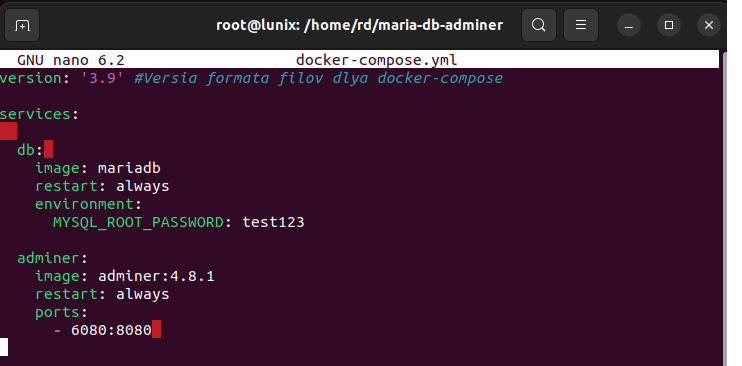
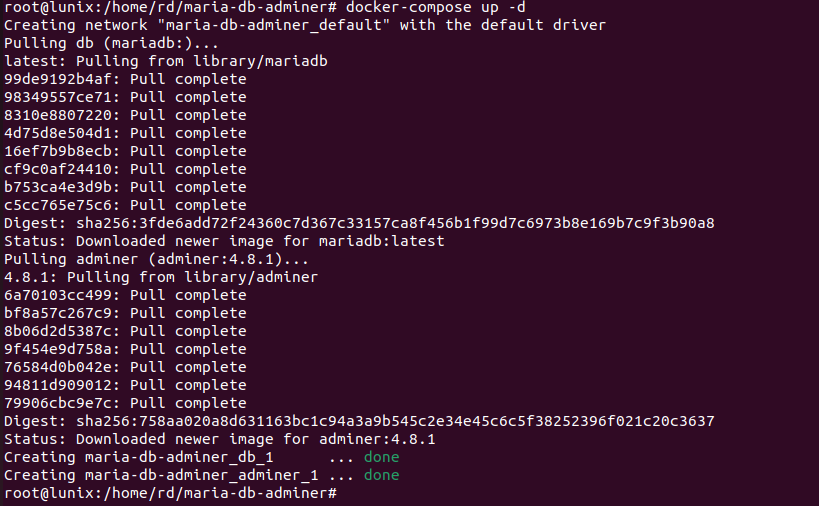
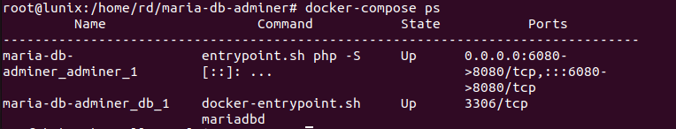
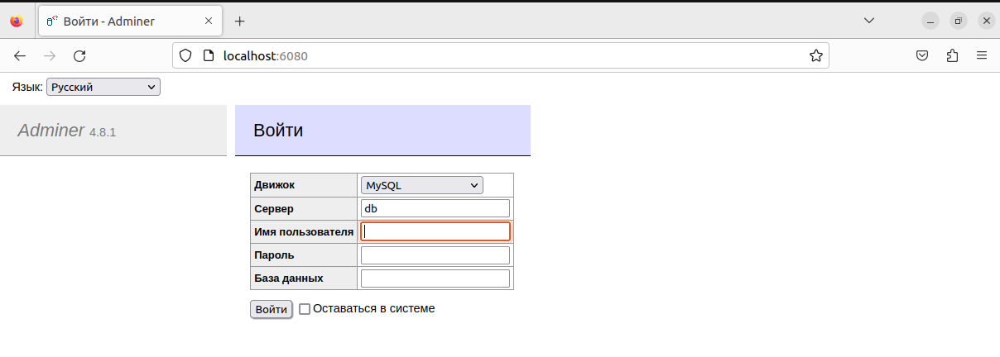
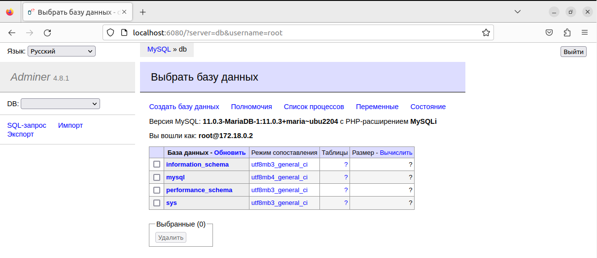

### Домашнее задание №5. Docker Compose и Docker Swarm

#### Необходимо создать сервис, состоящий из 2 различных контейнеров: 1 - веб, 2 - БД (compose).

**Решение:**

1. Создаем директорию, в которой будем работать. Переходим в созданную директорию. Внутри директории создаем файл docker-compose.yml: 

2. Содержимое файла docker-compose.yml:\

3. Устанавливаем docker-compose:\

4. Запускаем наш проект: 

5. Видим, что появились два контейнера:\

**Результат:**

1. В браузере по адресу http://localhost:6080 открывается админ-панель:\

7. Указываем root как Имя пользователя и вводим пароль, который мы задавали ранее при создании файла docker-compose.yml (test123). Выполняем вход и видим, что используется база данных MariaDB.\
